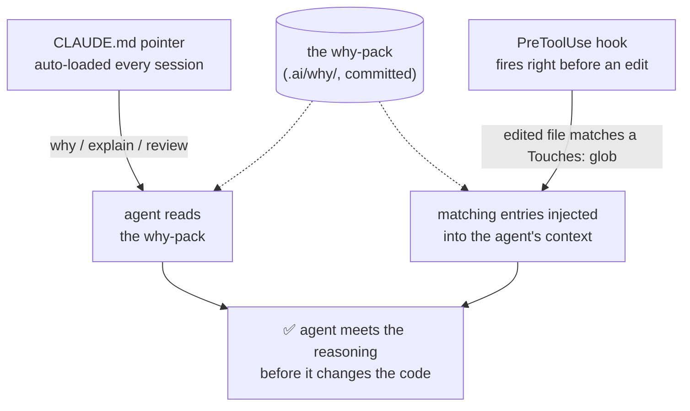

# Grepathy

**Make agent-written code reviewable.**

When a coding agent builds a feature, it makes a bunch of small decisions along the way that you never really approved. Later someone reviews the PR and asks "why was this done this way?" and you don't know. The answer is buried in a chat transcript on your laptop, and Claude Code deletes those after 30 days by default.

Grepathy reads your session transcripts locally, pulls out the decisions, and writes them to a markdown file that gets committed with your code. Now the repo can answer "why" on its own, for reviewers, teammates, and future agents.

```bash
npx grepathy init
```

## What it looks like

Real example: on a contract project, my agent decided on its own to pre-create guest users in Clerk. It wasn't in any plan. The CTO saw it in the PR and asked me why. I had no idea, because I hadn't made that decision. With Grepathy, it would have been in the repo:

```markdown
### Guest identities are pre-created in Clerk
Status: agent-initiated — not requested in plan or prompts
Touches: `lib/clerk/*`, `db/schema/guests.ts`

The agent inferred this approach to simplify downstream auth checks.
No explicit rationale was discussed.

Risk: guest users diverge from the normal signup path.
Reviewer attention: confirm whether guests should be modeled as normal users.
```

Run `grep -rn "agent-initiated" .ai/why/` and you get a list of every decision the agent made without asking anyone.

## How it works

You don't run Grepathy. It runs itself off hooks:

```bash
claude        # work normally, let the agent commit as it goes
git push      # Grepathy writes the why file and shows it to you for review
```

A few things worth knowing:

- It works from the transcript after the fact. It never asks the agent to "log its decisions" mid-task (we tried that first, agents just don't do it).
- Each branch gets one file: `.ai/why/<branch>.md`.
- Future agents actually see this stuff. A note in `CLAUDE.md` points them at the why files, and a hook injects the relevant entries right before an agent edits a file that has history.
- It never blocks a push, never touches your staging area, and never pushes anything itself. It plays fine with multiple agents and worktrees.

**How a future agent meets the why** — two automatic triggers, both reading from the committed why-pack, so the agent never has to remember to go look:



No server, no accounts, no bot. It's a CLI, some hooks, and markdown files in git. Full detail in [docs/how-it-works.md](docs/how-it-works.md).

## Privacy

Your transcript never leaves your machine. The only thing that gets shared is the markdown summary, and the summarizer follows strict rules: it never quotes your messages, never describes your confusion or back-and-forth, never includes business or money details, and strips secrets. Two deterministic checks sit behind the prompt (a secret/finance scanner and a rule that every entry must point at real code), then you review the file before you push. If you edit or delete an entry, Grepathy respects that forever.

More detail in [docs/privacy.md](docs/privacy.md).

## What it's good for (we actually tested this)

We ran a blind, pre-registered eval against an honest baseline and published the whole thing, including the parts where the tool lost: [docs/REPORT.md](docs/REPORT.md).

Where it helps:

- **Saving reasoning before it's deleted.** Claude Code throws away transcripts after 30 days. Two of our own projects lost their entire history before we could even run the eval. `grepathy init` offers to backfill whatever is still alive.
- **Knowledge that isn't in the code.** Things like "we considered a CDN and rejected it" or "the agent did this on its own, nobody approved it" leave no trace in the code. In our tests, agents with the why file got these right. Agents without it made up plausible-sounding wrong answers.

Where it doesn't help, honestly:

- It won't stop an agent from refactoring away important code. We tested that directly and it didn't.
- It doesn't make agents smarter in general. If the answer is readable from the code, agents find it fine on their own. Grepathy only matters for the stuff that's written down nowhere else.

## Commands

| Command | Purpose |
|---|---|
| `grepathy init` | Install hooks and dirs. Safe to re-run. Offers to backfill old sessions. |
| `grepathy status` / `doctor` | Health checks, what's distilled, what's stale. |
| `grepathy context <path>` | Show the entries that apply to a file. |
| `grepathy sync` | Distill and commit right now (still never pushes). |
| `grepathy distill` / `repair` / `off` / `on` / `uninstall` | The rest. `--help` for details. |

## FAQ

**How is this different from Beads and the task-tracker tools?**
Those track what agents should do next. Grepathy records why things were already done. You could use both.

**Why not just turn off transcript deletion?**
You can, but then you have gigabytes of raw chat logs on one laptop that you'd never share with anyone. The why file is small, safe to share, and lives in the repo where your team and their agents can actually find it.

**Does it work with tools other than Claude Code?**
Anything can read the why files, since they're just markdown. Writing them currently requires Claude Code. A Codex adapter is next.

**Where are the deep dives?**
[Architecture and git behavior](docs/how-it-works.md) · [why-pack format](docs/format.md) · [parallel agents](docs/parallel-agents.md) · [config](docs/config.md)

## Development

```bash
npm install
npm run build      # tsc -> dist/
npm test           # compiles src + test, runs the node:test suite
```

Zero runtime dependencies; pure TypeScript. The test suite is hermetic — no Claude, API key, or network needed (the LLM is mocked, git runs in throwaway temp repos) — so `npm test` runs anywhere with Node >= 20 and git. It covers transcript parsing, why-pack merge and human-edit preservation, semantic dedupe, the privacy/secret/finance validator, per-session state and concurrency locking, branch attribution, and the scratch-index auto-commit. See [CONTRIBUTING.md](CONTRIBUTING.md). The write-side adapter and read-side pointer/hook pattern are both per-tool seams designed to make a new tool (e.g. Codex) a small addition.

## License

MIT
